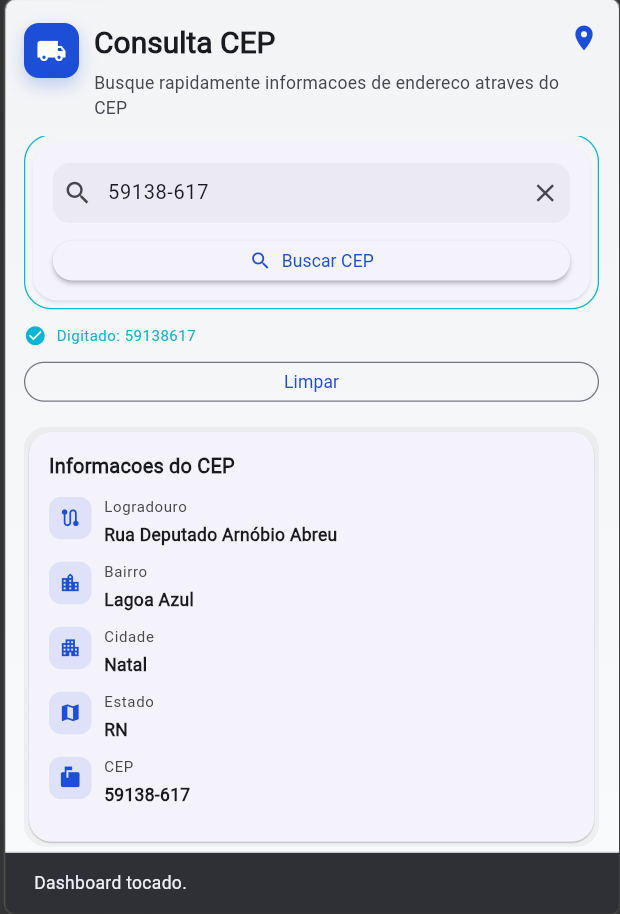
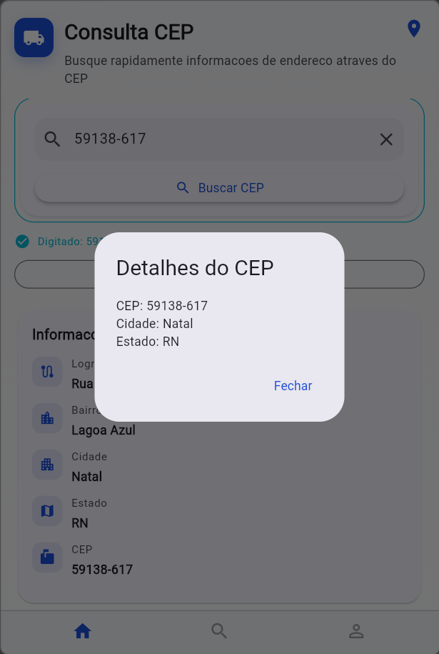

# 2. Eventos e Interações

A aplicação utiliza diferentes tipos de eventos do Flutter para tornar a interface mais interativa e dinâmica. Foram implementados os eventos `onChanged`, `onPressed`, `onTap` e `onLongPress`, cobrindo entrada de dados, ações de botões e interações por gesto.

O evento `onChanged` foi aplicado no campo de texto do CEP para validar os dados em tempo real enquanto o usuário digita. A partir dessa validação, o botão de busca é habilitado ou desabilitado automaticamente.

O evento `onPressed` foi utilizado nos botões da aplicação. O botão principal realiza a validação do CEP, inicia a requisição para a API ViaCEP e atualiza o dashboard com os dados retornados. Já o botão secundário é responsável por limpar os campos e redefinir o estado da tela.

Na área do dashboard foi utilizado `InkWell` para implementar interações por gesto. O evento `onTap` exibe um `SnackBar` de feedback rápido, enquanto o `onLongPress` abre um `AlertDialog` com informações adicionais do CEP.

O fluxo de eventos ocorre de forma encadeada:
digitação no `TextField` → validação → ativação do botão → requisição da API → atualização do dashboard → feedback visual.

Durante o carregamento, os botões ficam temporariamente desabilitados para evitar múltiplas requisições simultâneas, garantindo maior controle das interações.

Como decisão de design, foram utilizados `SnackBar` e `AlertDialog` para fornecer feedback visual imediato ao usuário de forma simples, clara e não invasiva.

## Evento de onTap no Dashboard

## Evento de onLongPress no Dashboard

